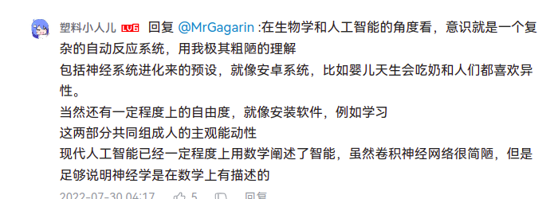
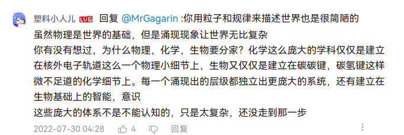
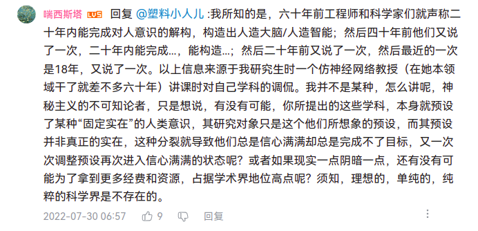

如果物理规则统治着一切，而意识只不过是粒子依照它生成的结果，那么当你判断这句话的正确性时，难道是粒子在审视它自己？

我们看到有不同于粒子的东西进行了判断的活动，这便是你，是你的主体性。

:如果物理规则是统筹万物的，那么一切存在都依赖科学真理，进而一切都是正确的。类似的，既然一切事物都通过自己的运动完美的实现了物理规律，那就不会有表象和内在的二分（？）。我相信这和你的感觉肯定是有冲突的。这时候，难道是粒子和自己产生了冲突？好像物理规律失算了？

这时候，我们再一次看到有不同于粒子的东西进行感觉的活动。他把握事物，于是产生了现象和内在的二分。这便是你，是你的主体性。

**你可以查先验框架或者先验统觉，和认识内容的区别。没看up视频，但是先验框架不能否认，这也是主体性的普遍必然的来历，不是说某个体有，而是所有人都有的先天认识能力。先验框架和认识对象或者认识内容的关系在停下来的时候可以总结为“先验主体性”，这个才是争论的焦点。你实际上混淆了先验框架这种确切的和“先验主体性”这种观念。这个时候还不用历史和扬弃，只是总结罢了。如果混淆了二者很容易发展成机械主义的你所反过来推理出的东西。他们还只是停在那里，并未发展，无需用历史观来看待，你只需让概念停下来，而不是让它到处破坏。**

将“物质的存在性”解释为“物质的观念预设”，将直接导致“物质”被偷换概念。

事实上，任何一种感观的效果被你名命为“现象”的时候，你是在对这种感官的效果进行“结果的综合”。而所谓的“预设”，不过是对这个已经被综合所得出的“效果”的概率推测。

所谓的对苹果的“实体”的“预设”，不过是你的感官得到了一些观察的“效果”，然后你推测下次见到类似的东西，它将能对应上“有那种效果的那个东西”。这是百分百成立的吗？显然不是。你在电视上看到一个像苹果的东西，但你并不会吃到那个苹果，得到一个“吻合苹果的效果的东西”（苹果的实体）。也就是说，你哪怕看到一个类似苹果的东西，也不一定存在一个真的苹果。

观念论往往从这里开始，迅速沦落入对经验论的攻击。声称，既然看到的苹果，不能百分百对应得到一个真的苹果，那么经验就是值得怀疑的。然而，这种论点却忽略了一个根本性问题，一个苹果之所以成为苹果，并非因为“它看起来像一个苹果”，也并非因为“我们预设某物是一个苹果”。事实上，人类根据对苹果的知觉产生对苹果的“印象”，这“印象”不仅仅包含“视觉的效果看起来像”，而是这个“印象”须在一切维度上“具有类似苹果效果”。也就是讲，我们无法区别一个东西在任何效果性质上与“苹果一般效果”的“印象”差异，我们就会将其认定为苹果。（哪怕这个东西存在一个假设的“实体”，而其“实体”可能不是苹果，我们也无法否认它是一个苹果。因为即便这个假设成立，它也满足苹果的感知效果）

这里面本质的问题其实在于，我们的感知是“有局限的”，这会导致从感知的效果中得到的存在某个“实体”的印象，也是有局限的。观念论会就此滑入将“实体”本身进行绝对化，以弥补这种“经验认识”的局限性的深渊。仿佛“经验不可靠”，“对经验的印象才可靠”。并且将这种东西取个名字叫“绝对理性”。

实践发展证明，经验的确不可靠，但这不是否定实证认识的理由。因为，经验它不百分百可靠，但却以一种概率的方式产生实证效果。

需要真正换脑子的是，科学大厦发展至今天，我们不能再以十八世纪的“绝对理性”概括世界或意识。出于“理性”、“真理”的错觉，否定实证的有效性，这个论证是不可能成立的。因为“事实”本身就是一种概率的存在，而不是绝对的存在。更别说建立在对“事实”的想象之上的理念抽象。将知觉的结果，称为“现象”也好，“作用”也好，一旦接受其只是一种概率化的“事实”，而我们的认知作用也从来不是按绝对认知进行运作，而是以一种概率模糊的方式存在着，那么，对于“物质”“世界”“意识”的认识则将又会有所解放。

打破“原因与结果”的“必然联系”，也就是说，不要再用“xx决定xx”这种“主观语言”。这并不容易。

即使重复实验一亿次，也只能证明有限的结果。而我们的“主观语言”，却会将其说成是“真理”。而且，为可弥补逻辑漏洞，还认为发明“绝对观念”，作为证明。然而，归纳法永远是一种对“大概率事实”的论证，而不是“绝对真理”的论证。除非，你能永恒地得出任何一种绝对事实的结论。所以，对待任何一种“将观念论绝对化的倾向”，都要有所保留。这就是为什么，科学不是颠扑不破的真理，而是允许被证伪的实证认识过程。