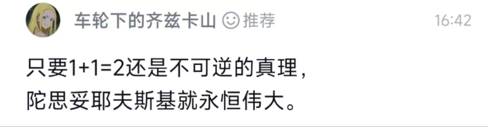

呜呜呜~我的条头糕没了，只剩小丑鱼了。我还蛮喜欢这个名字的。

恬不知耻的稍稍诠释一下吧，条头糕喻指生活中美好的事情吧，条头糕甜，桂花糕香，像极了可爱的少女，满上简直可爱到过分了。和小丑鱼一样两者都是你的自我认知吧。

所以遗失了可爱的自己。

生存在了车轮之下？

恭喜你从海洋走到了大陆，（~~尧尧超进化~~）。

**“生存在车轮下”** 我想从两方面阐释这个课题。

其一是生存论，其二是精神分析。

> 程序员的世界里没有2，1+1=10。世界上有10种人，懂二进制的，和不懂二进制的。
>
> (10 是2的二进制表达，1是进位)
>
> 我~~不~~（jiu）是杠精.绝对~~不~~（jiu）是

## 一、存在先于真实

笛卡尔曾经有一个精巧的推论：我思故我在。当我怀疑一切事物的存在时，我却不用怀疑我本身的思想，因为此时我唯一可以确定的事，就是我自己思想的存在。所以记忆的真或假并不是一个关键问题，“存在”这个事实本身更为基础。极端如《黑客帝国》所描述的矩阵中的生命，但必定要“存在”，否则“真实”就无从谈起了。

这里提供一个思想实验

一个朋友告诉你，根据《泰晤士报》报道，唐宁街发生了一起枪击案，然后还拿给你看手机新闻，但是你对国外的事并不感冒，所以就敷衍说知道了，你知道了唐宁街发生了一起枪击案，反正你也不会去英国，也不会关心英国佬的死活但事实这个新闻包括网页都是你朋友伪造的。你算不算得到了一个“假记忆”，如果不算，那假记忆和真记忆的区分是什么？你可以说：符合客观事实的就是真记忆。但是我们从来看不见客观，只看见媒介而已。一个收银员会觉得收到的钞票真假比唐宁街枪杀案更客观。

那么我们可以发现，**记忆真假来源于你的生存和社会结构的耦合程度。**

你可以相信这个世界上有佛祖，并且一直保持这个“假记忆”，只要你不在一个宗教迫害严重的地方生存。历史上出现的政权迫使异教徒“改宗”的事情，或者你考研究生因为大纲修改而重新买参考书（计算机考研血泪！！！）

**就是用“真记忆”替换“假记忆”的过程**。

那么我们可以大胆一点的说，**记忆的真（稳固）的程度和记忆关涉社会结构的程度成反比，和个人生存结构成正比**。在虔诚的信徒那里，1+1=2 ，并不比上帝存在更加真实。在~~虔诚~~的程序员那里，1+1=2 ，并不比二进制更加真实。

1+1，是如此真实，恰恰是他关涉于每个人的生存（数，金钱）。

## 二、记忆是“时间之追问”

记忆是个体在生存的世界中对纷繁复杂的信息手足无措，被迫创造（演化）出来的机制，对于一只丛林的蜱虫，它又聋又瞎，它仅需通过嗅觉捕捉哺乳动物散发的酪酸味，再盲目跳到它们身上，吮吸37°的温血，这样一个近乎机械的过程完全不需要记忆，**如果他们有真理，那就是37度**（~~42~~）。因为蜱虫不会被生存所困扰，它没有白昼的世界里，37°是它的一切，当然更不需要时间。

而人类无力靠自己的感受器官就制备生存所需，狩猎采集时代他要深谙野外求生，勉强温饱，农业文明时代他要知天时，方能不误农时，勉强温饱。工业时代他要出卖自己的劳动力，变成机器的附属，勉强温饱。信息时代他是信息海洋里一个小比特，消解自我，勉强温饱 。

人类记忆更像是个工具箱，存储如此多的信息才够生存，“时间”的概念都要被单独提取出来做单位，因为时间过去现在未来其实就拆分成如下：

记忆（目前不用的信息）；

求存（当下要用的信息）；

筹划（未来生存要用的信息）

我国伟大的哲学家庄子曾说：“上古有大椿者，八千岁为春八千岁为秋”草木枯荣，生死不过是一个连续统，而人却在“时间”中追忆（过去），彷徨（现在），踌躇（未来），像是一个钟摆。

**那么我何以自在？**

**我何以在这动荡不羁的时间流中自在**

**这无非凸显了个体在信息时代中普遍境遇** 。

_**下集预告：对于自我的追问，恰恰是人在“空间”中的迷失。**_

to be continue ........写不动啦~~

