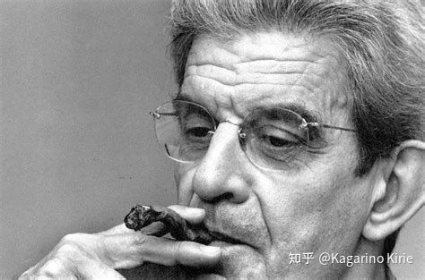
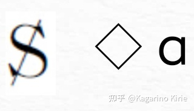
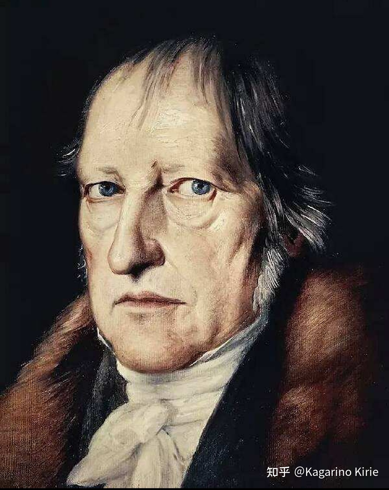
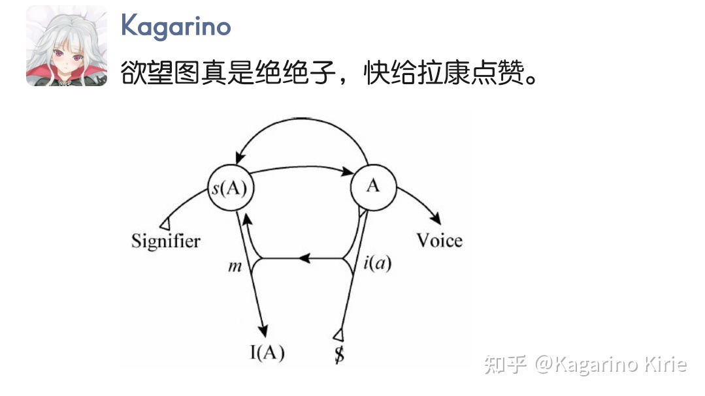
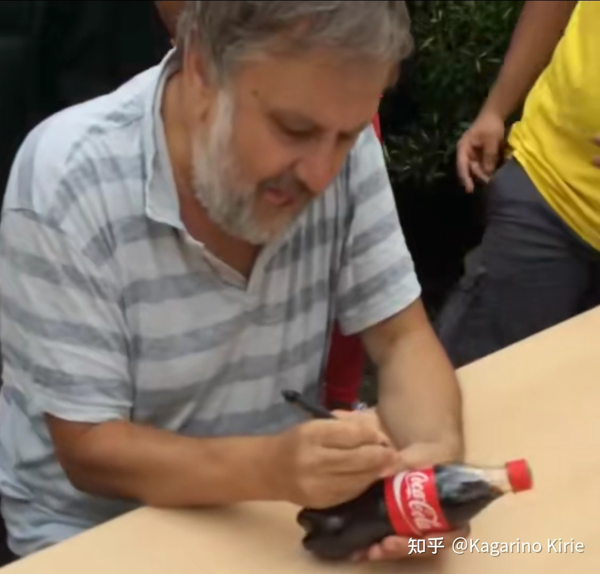

> 如果说有一个概念堪称是拉康思想的核心，那就是欲望概念……欲望既是人类存在的中心，也是精神分析学的核心。（Dylan Evans，An Introductory of Lacanian Psychoanalysis，p.36)

​																								雅各 拉康

## 导言

在PartA篇，笔者尽可能用简单的描述阐明了

* 欲望的辩证法（欲望为何无法被满足）：欲望的唯一目的是再次生产欲望。
* 欲望的基本运作（快感的来源）：压抑与创伤性。

而在本篇，笔者将尝试更加深入的阐明欲望的对象与为何欲望是守卫主体的唯一途径，当然，还有为何不应向欲望让步。同时将不可避免的涉及部分三界理论、镜像阶段。对于本篇来说，阅读难度及深度将略高一些（虽仍是极为浅显的）。

因为在构思此文之前就已将文本定位为兴趣导读与入门性质文本，所以建议没有阅读上篇的 初入者 选择性阅读。鉴于笔者水平，文中必有大量谬误之处，还请指正。（学艺不精，瞎几把写的，都可以批判）

## α.镜像阶段

> 我在我不思之处，故我于不思之处在。（Ecrits,Lacan）

* [ ] 这里可以链接[唯物与唯心之分](/home/orange/文档/答尧尧问/唯物与唯心.md)

> 他者先与自我存在

主体如何维持同一？主体如何保证自我认识？在拉康的理论中，婴儿确定自我是一件需要去做的事情。身体成为主体性的容器是弗洛伊德的观点（或许也是尼采），然而在最初的情况下婴儿只能看到"无身体的器官"：一些肉与肢体在视野中浮动，却始终无法建立起必然性的联系。为了确立自我，婴儿必须首先将自我对象化。这就是说，他者的存在必先于自我的存在。

当然拉康所说的镜子仅仅是比喻而非确指，这个镜子可以是任何用来帮助主体构建自我认同的他者，朋友、父母、任何人都可以（因为镜像阶段并不只发生在婴儿时期）。

但是仅仅建立起镜子中的光线与主体的联系是不足够主体维持自身的，此时的自我认同并不完整，镜子中的影像始终不真正是主体自身——仅仅是我们将其误认为我们自身的一个他者。并且婴儿始终无法进入象征界，此时作为语言的大他者还未入场，更多的是由母亲填补大他者的空缺。随着大脑的发育，语言回归大他者的位置并开始婴儿对实在界进行象征化的过程。这个过程中主体不仅可以理解"我"这个符号的能指与所指，与之伴随的是理解可以代表自我认同的符号。举个例子，主体可以用"我"来指称自身而不再简单的说出没有主语的短语，从"do something"变为"I do something"。

小客体a作为一种主体（或实在界）的剩余产生了，这是对实在界进行象征化所带来的必然后果，因为对于实在界的象征化或掩盖是无法彻底的，我们永远不可能彻底视实在界于无物。欲望与小客体a相伴而生，欲望的真正对象即是小客体a。

由于篇幅所限，本文在此不对性化与镜像阶段进行更繁杂的复读，基本理解镜像阶段即可。

## β.欲望于非我之处在

> 拉康将传统笛卡尔式的主体改造，恰恰解释了何为"哲学的我思是一种幻象的中心"。

现在我们已经知道：主体通过他者构建了自我，主体必须将"我"的能指认为是我（言说主体，我的能指仍然没有所指，"我"永远是空洞而不可指的），将镜中影像的光线认为是我。那么作为同样非我的欲望是否也帮助主体构建了自我？

欲望不在我之中，外在于我却可使我成为我。欲望总是指向我们想要拥有的事物，听起来像废话，但这句话其中揭露的完整性至关重要：主体永久性的缺失一项事物，所以主体才可以无法到达完满，否则自我便是不动且僵死的。

你曾幻想过自己拥有某些品质或身份吗？你曾幻想过自己拥有某一事物或成就吗？我想恐怕是曾幻想过的。显然，主体所欲望之物均为主体所尚未拥有的，然而当主体拥有所欲望之物时主体的欲望并不会消失。

主体所幻想之物与所缺失之物即是小客体a。

幻象公式在此略过

> 被划杠的S代表分裂的主体、欲望的主体，小写斜体的a代表欲望的原因，代表已经永远失落的欲望对象，代数符号“◇”则表示两者之间的关系。（阅读你的症状,吴琼）

小客体a不会消失，其始终作为主体的匮乏存在（尽管小客体a不存在），这是不可逆的操作。当主体进入象征界时符号的作用必然导致小客体a从主体自身缺失。

在PartA中笔者已经论述了欲望为何是匮乏的以及为何欲望无法被满足。笔者想说的是我们对待自己的幻想总是暧昧的。因为主体的欲望最终可以概括为虚假存在的真实自我（得到小客体a的我），得到小客体a的我将是再无所求的。

> 与其说欲望没有对象，不如说欲望的对象就是小客体a

欲望的对象是虚构的不存在之物（小客体a是无法言说的，语言对于小客体是无能为力的），然而我们确确实实想要成为某样态的人，或许是A或许是B。至少我们相信，当我成为理想自我之时我的生命将更加完满或更有价值，否则我们对待自身将毫无目的性且虚无的。可我永远无法成为真实自我，主体只是幻想了一个虚构的不存在之物成为"理想自我"并远远的靠近它。主体从不能真正成为主体想要的自我，那样会失去主体欲望之物。

用柏拉图的视角来看就是主体时刻不在摹仿"自我"的理念，而又永远无法成为"我想要的我"。只不过在拉康这里"真实自我"是由主体欲望构建的虚幻存在，并没有"真实自我"这个理念存在。

> 完全的主体化是不可能的；主体间的关系是不可能的；主体的欲望满足是不可能的；性关系是不可能的；爱是不可能的；乃至最后，精神分析也是不可能的。（阅读你的症状,吴琼）

所以，欲望是非我而又作为否定性的力量构建自我认同。这就是为什么镜像阶段并不只发生于婴儿时期，事实上镜像阶段无时无刻不在发生否则我们将无法构筑主体的同一性。

## γ.他者的欲望

> Man’s desire is the desire of the Other.（Lacan）自我意识的辩证法就是欲望的辩证法，拉康与黑格尔的联系密不可分。

我的欲望总是他者的欲望。在PartA部分，笔者更多的论述了作为动物性的欲望而略去了作为他者的欲望。所以，以社交媒体为例，在现代社会中社交媒体承担了大部分的凝视作用发生场地，我们每个人早已习惯于凝视他人并且被凝视着。在被他者凝视时我们将自己认为成"理想自我"从而导致问题的产生。

> 显现为一个自我，本质上不同于和完全对立于非我的自我。（人的）自我是一种欲望——或欲望的自我。人的存在本身，意识到自己的存在，意味着欲望，必须以欲望为前提。（黑格尔导读,科耶夫）

辩证法.jpg

通俗点讲，主体总是会给自身贴上不同的标签并渴望他者的凝视，对于主体来说，他者的凝视就像胶水一般可以固定贴在主体上的标签以防它们掉落，主体从他者的凝视之中获取自我，就如镜像阶段所发生的一样。而标签的掉落显然是创伤性的（大部分情况），那意味着主体对于欲望之物的彻底失败——主体不得不接受我不是我自己。而理想自我根本就是由标签构成的罢了，别无其他。更多时候主体常常幻想在大量他者（即使独自一人也仍有大他者在场）的凝视下取得某些成就或主体所欲望之物是很正常的。

> 《成功学一百二十八讲》《如何让你更受欢迎的三十七个小妙招》《高情商话术四十九问——职场成功秘籍》是的是的，我们渴望成功、更受欢迎、"更高情商"，但这通通是他者的欲望，被产生的欲望反过来强迫主体产生焦虑，只有如此才能赚的盆满钵满。

你应该取得成功，你应该做一个有钱人，你应该拥有一双价值8888的潮鞋，你应该....在我们说出如何解决问题时，我们早已预设了问题的存在——这就是问题。他者不断将欲望投射于我，直到我信以为真。他者总是将一种完美的姿态展示给主体，正所谓："如果我.....那么我就死而无憾了。"

&amp;amp;amp;amp;amp;amp;quot;化解焦虑&amp;amp;amp;amp;amp;amp;quot;

这下1-4-3了，掌握了心理学就掌握了你的人生

凝视在此过程中至关重要，凝视一定与本体的缺失之欲望有关。因为网络的诸多特点导致其成为了获得凝视与凝视他人的最佳场所，在社交媒体上的身体展示显而易见是一种对凝视的渴望。这恰恰说明了主体通过被他者凝视可以构建起主体的同一性："我匮乏某种特质，但我希望有他者承认我拥有某种特质，在那时我将成为真正的我（他者认为我拥有比我是否真的拥有更重要）。"并非说主体被他者凝视的部分一定是主体所匮乏的，而是说主体仅仅是希望他者通过凝视认同主体。然而他者对主体的认同显然与主体并没有丝毫的关系，就像猹是鲁迅先生生造的一般。

诞生自焦虑，死亡于焦虑

一个显著例子就是我们似乎总会发现身边的人陷入了某种焦虑，笔者举一个最简单的例子：身材焦虑。每一个个体都拥有"符合大众审美的身材"是不可能的，特殊性会被消弭的荡然无存。然而美颜、修图为主体带来了便利的工具，大部分人在经过一些专业修图操作后无论是身材或是颜值都不会低于平均值。这就为弥补主体间的缝隙提供了机会：主体通过自拍后的美颜与修图弥补与他者的欲望（如明星或某种主流审美）之间的差距，通过得到他人凝视后的认同，主体维护了主体对自我的同一性。然而至关重要的是我们的焦虑并非由自我产生，仅仅是他者强加于我。但这在如今已经算不上什么——随着社交平台的成熟，他人的认可早已被可视化——我们沉醉于朋友圈可视的点赞数时、沉醉于微博知乎的浏览数收藏量以及本文的点赞数时心中所感的愉悦等等表现并不夸张。这也就是为什么有的唠格即使盗图也要让自己在别人眼里过的大富大贵、穷侈极奢。数据俘获了我们只是表象，其内核是我们对于欲望的让步。

我不知道绝绝子是什么意思但我就是要玩&amp;amp;amp;amp;amp;amp;amp;我不懂拉康但我要别人认为我懂拉康

这里还有另一有趣的点在于为什么我们的审美似乎在不断降低门槛，将美的贬低为不美，将不美抬升为美。笔者在此无意于预设美的价值判断以及批判主流审美是否一定正确，仅仅想说我们的审美几时变得如此委曲求全？在部分短视频平台庸俗的身体展示极为常见，然而受众则大多对于内容质量选择性盲目。我想正是这种由双方所共同构建的审美结构（在笔者看来很诡谲）在欲望的推动下逐渐流俗起来。

同时，他者的欲望还有另一重意思，即我们的欲望对象总是他者欲望的对象。奢侈品与诸多装饰品的价值所在不是美学价值而只是因为他者欲望奢侈品，所以我也欲望奢侈品。

归根结底，每一个主体都欲望着被他者欲望、被他者凝视同时又欲望着他者的欲望这种循环否定使得每个主体不得不承认他者以此在互相之间获得自我同一性。欲望不可满足的第二个原因就是主体将他者的欲望（否定性）当作自己的欲望（否定性）以此填补自身的匮乏是一个非法操作，负数与负数相加仍然是负数。

## δ.作为欲望与焦虑的小客体a

> 把他者的欲望看作是自己的欲望终究只是主体的欲望的幻象，其在主体身上所引发的与其说是欲望的满足，不如说是焦虑，因为那个作为欲望之原因的小a根本上是一个欠缺，是主体在实在界打开的一个空洞......我们总是以他者的欲望来规定自己的欲望，总之，我们的欲望并非我们自己的，而是在他者中且通过他者被结构的。可是，他者究竟欲望什么？他者究竟想从我这里得到什么？主体对此完全不知，他者的欲望之谜令主体焦虑不已，在他者欲望的煎逼之下，在欲望满足的失败中，主体一次又一次遭遇到自身的残余性。（阅读你的症状,吴琼）

于是，焦虑的产生就显得很明了了，主体并非因欲望对象远离与推迟而感到焦虑，而是因为过分靠近欲望对象本身即小客体a而感到创伤性的焦虑。

"你想要什么"成为了焦虑的来源，也就是说小客体a作为一个硬币，其一面为欲望而另一面为焦虑。当主体与小客体a保持距离时，硬币显示为欲望，而当主体过于靠近小客体a时，硬币显示为焦虑。前文已经提过，小客体a作为实在界象征化的剩余存在，其不可言说也不可接触，因为无论是实在界还是小客体a都是主体无法面对的。面对实在界就会遭遇真正的创伤性时刻，那代表着主体面对真正的不可言说的虚无。

象征界与想象界甚至可以说是作为实在界的马赛克而存在的，主体通过象征界与想象界而无需直接面对实在界。实在界本身喻示了语言的无力、欲望存在的虚假等等诸多"真实"：主体无法控制自身的一切，自我是被捏造的虚假存在，一切的最终都是毫无意义的。

而对于三界的涉及就到此为止了，想要阐明小客体a并不是本文的重点且更深层次的解释还需要牵扯原乐以及原质等等概念。总的来说，欲望之所以守卫主体存在性即是缘由作为小客体a的存在，小客体a即是主体的匮乏也是主体的剩余，即是实在界的剩余也是欲望的存在基础。欲望保障了主体不至于直面实在界，但它同时带来了源自实在界的真实——焦虑。

## ε.直面他者的欲望

现代消费主义的机理在于欲望是可以被创造的。作为大他者的消费主义创造出的廉价欲望等待通过凝视而作为主体的欲望存在，而主体却深陷于意识形态中盲目的接受被批量制造的欲望无法抗拒。又于网络社交平台的飞速发展，凝视在我们的时代被迅速结构化，凝视无处不在，凝视不可或缺。铺天盖地的广告向我们灌输着解决问题的方式，即使问题从未出现（想要快乐吗，快来喝可可可乐。想要成功吗，快送猫猫猫台）。与其说我们在看广告，不如说广告之欲望在凝视我们。

一个被商品符号捕获的人

商品作为符号本身已被扭曲为神圣的存在，所有人拜倒于商品面前而不自知。因为即使我们勘破了意识形态的陷阱，我们仍无法摆脱商品。抽离了商品那么我们的社会本身将留存下何物？抽离了消费主义我们的欲望将会短暂的空转，抽离了资本主义我们将惶恐不安。"你想要什么"于内核来说是等同于"我想要什么"的。在当今社会背景下的每一个主体的欲望早已被消费主义"规训"，我们甚至不敢发出反抗的声音。尽管它有剧毒，但我们却不得不暂时忍受它。996剥削人的时间使之无暇关注生活，那么资本主义下对人欲望的剥削并不比对于时间的剥削乐观许多：积累是不可能的、娱乐是不可能的、休息是不可能的。所以笔者认为以何种方式运用欲望为武器、运用精神分析解构意识形态是我们不同于之前的所有时代的问题。当我们使用消费主义本身反对消费主义的时候，我们就应已预见到处境的危险，一切之一切都已被商品化：爱是可以购买的、性是可以购买的、享乐是可以购买的，归根结底，我们被名为意识形态的导游强制消费了欲望这件华丽的商品。

互联网本身作为作为符号与图像传播极快的场所作用已然类比为真实存在的想象界，符号无处不在所营造出的气氛就是主体可以不加反思的接受而不会感到异样。符号的传递速度越快，我们就离噩梦更进了一步，欲望不再由主体虚构而转为由他者虚构导致主体的价值存在必须依附他者。主体在被作为大他者的意识形态传唤过程中就已然接受了对自身的固定——象征的场所不存在、意义不存在，唯独剩下符号空洞的指向自己。

我们需要直面他者的欲望，他者对主体欲望的肆意蹂躏应当被面对，无论我们是否有能力去反抗或去承受，都不应向欲望让步。勇敢的追求必然的失败，那即是必然的成功。

后记：其实笔者在构思PartA之前没有想过最后会分为两篇写完，甚至都没有想到篇幅会如此之长。可能是多个概念杂糅不好单个陈述且笔者水平过浅导致没有达到预期效果。作为笔者因突发奇想而撰写的两篇文本如果让笔者自评一下，那就只能是浅入浅出。总之，希望本文与上篇可以作为较好的精神分析兴趣读物（不敢妄称入门文本），对初入者起到良好的作用。谢谢。